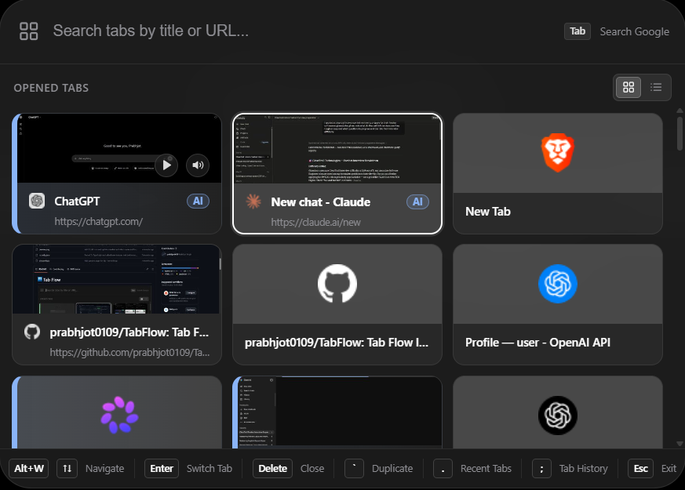

<p align="center">
  
</p>

<h1 align="center">Tab Flow</h1>

<p align="center">
  <strong>The tab switcher your browser should have shipped with.</strong><br />
  Navigate dozens — or hundreds — of tabs visually, instantly, without ever touching your mouse.
</p>

<p align="center">
  <a href="https://github.com/prabhjot0109/TabFlow/releases"></a>
  <a href="./LICENSE"></a>
  <a href="#installation"></a>
</p>

<p align="center">
  
</p>

---

We've all been there. Thirty-seven tabs open across three windows. One of them has that Stack Overflow answer you _just_ read ten minutes ago, but the tab bar has become a wall of indistinguishable favicons. You click through five or six tabs, lose your train of thought, and end up Googling the same thing again.

Browsers give you a tab bar. Tab Flow gives you a way to actually _use_ it.

## What Tab Flow Does

Tab Flow replaces the painfully slow "hunt and click" ritual with two keyboard-first experiences:

| Mode | Shortcut | What it feels like |
| --- | --- | --- |
| **Quick Switch** | `Alt + Q` | Windows Alt+Tab, but for browser tabs. Hold Alt, tap Q to cycle, release Alt to land. Zero typing. |
| **Tab Flow** | `Alt + W` | A full overlay with live thumbnails, fuzzy search, media controls, tab history, web search, and more. |

Both modes open in **under 100 ms**, with real screenshot previews instead of a wall of identical favicons — no more guessing which "Untitled Document" is the right one.

---

## Features

### 🔍 Fuzzy Search

Start typing and Tab Flow filters your tabs instantly by title _or_ URL. The search is fuzzy, so typing `gh pr` will surface your GitHub pull request even if those letters aren't adjacent. Consecutive character matches, word boundaries, and match position all factor into scoring, so the right result floats to the top.

### ⚡ Quick Switch (Alt+Tab Style)

Press `Alt + Q` and Tab Flow shows a compact grid of your most recently used tabs, ordered the way your brain expects — most recent first. Hold Alt, tap Q to cycle, release Alt to switch. The whole interaction takes under a second.

### 🖼️ Live Thumbnail Previews

Tabs show real screenshots — in both **Tab Flow** (`Alt + W`) and **Quick Switch** (`Alt + Q`). No generic icons, no text-only lists. You can visually scan for the page you want the same way you'd flip through papers on a desk.

Out of the box, previews are captured using the `activeTab` permission — Tab Flow grabs a screenshot of the tab you're on at the moment you open the switcher. So a tab gets its preview the first time you open the switcher while on it, and it's refreshed each time after. Tabs you haven't opened the switcher from yet show clean favicon cards until then. The upside: **no "read and change data on all sites" permission at install**, and Tab Flow never captures or touches a page in the background.

If you'd rather have a preview for every tab, the options page has an opt-in **Full Previews & Media Control** toggle. Granting it lets Tab Flow snapshot each tab as you switch to it, so coverage fills in as you browse — and it's what makes play/pause work on tabs you haven't opened the switcher from. It's off by default and you can revoke it at any time. Screenshots stay in local storage either way.

### 🔊 Media Controls

Tabs playing audio are marked with a speaker icon. You can **play, pause, or mute any tab** directly from the overlay without switching to it first. No more hunting for the rogue YouTube tab auto-playing in the background.

### 📂 Tab Groups

If you use Chrome's built-in tab groups, Tab Flow respects them. Grouped tabs carry their group's color and name, in both Tab Flow and Quick Switch, so you can tell at a glance which project a tab belongs to.

### ⏪ Tab History

Press `;` inside the overlay to view the **back and forward navigation history** of the current tab. Navigate with arrow keys and press Enter to jump to any entry. Powered by the Navigation API, so it mirrors your browser's actual history stack.

### 🔄 Recently Closed Tabs

Press `.` to switch to a list of recently closed tabs and restore any of them with Enter. It's like `Ctrl+Shift+T` but better — you get to _choose_ which closed tab to bring back.

### 🌐 Web Search

Press `Tab` inside the overlay to switch into web search mode. Type your query and press Enter to open a Google search. It's a small thing, but it means you never have to leave the keyboard flow to search the web.

### 📑 Duplicate Tabs

Press `` ` `` (backtick) to duplicate the currently selected tab. Useful when you want to branch off from an existing page without losing your place.

### 🎨 Adaptive Design

Tab Flow's overlay is a clean, opaque panel with smooth transitions, and it automatically adapts to your system's light or dark theme. It deliberately avoids backdrop blur — blurring the live page behind the panel costs a GPU pass on every frame, and a switcher that has to open in under 100 ms can't afford it.

### 🖥️ Works Everywhere

Chrome blocks extensions from injecting content on `chrome://` pages, the New Tab page, and the Web Store. Instead of giving up, Tab Flow opens a **popup window fallback** with the same functionality. You never lose access to your tabs, no matter what page you're on.

### ⚙️ Configurable Settings

Open the options page to fine-tune:
- **Screenshot quality** — choose between Performance, Normal, or High
- **Cache limits** — control how many tabs and how many megabytes of screenshots are stored
- **Default view** — choose Grid or List layout for both Tab Flow and Quick Switch
- **Keyboard shortcuts** — remap commands through Chrome's native shortcut settings

---

## Keyboard Shortcuts

### Inside Tab Flow (`Alt + W`)

| Key | Action |
| --- | --- |
| `↑` / `↓` / `←` / `→` | Navigate through tabs |
| `Enter` | Switch to the selected tab |
| `Delete` | Close the selected tab |
| `` ` `` | Duplicate the selected tab |
| `.` | Toggle recently closed tabs |
| `;` | View tab history (back/forward) |
| `Tab` | Enter web search mode |
| `Esc` | Close the overlay |

### Inside Quick Switch (`Alt + Q`)

| Key | Action |
| --- | --- |
| `Alt + Q` (hold Alt) | Cycle to the next tab |
| `↑` / `↓` / `←` / `→` | Move the selection |
| `Enter` | Switch immediately |
| Release `Alt` | Switch to the selected tab |
| `Esc` | Cancel and close |

### Global Commands

| Command | Default Shortcut |
| --- | --- |
| Show Tab Flow | `Alt + W` |
| Quick Switch | `Alt + Q` |
| Cycle Next Tab | `Ctrl + Shift + K` |

> **💡 Pro Tip:** Want to use `Ctrl+Tab` instead? Go to `chrome://extensions/shortcuts` and remap the commands to whatever feels natural. Makes Tab Flow feel completely native.

---

## Installation

### Chrome Web Store

Coming soon — star this repo to get notified when it's live.

### Manual Install (Developer Mode)

1. **Clone the repository:**

   ```bash
   git clone https://github.com/prabhjot0109/TabFlow.git
   cd TabFlow
   ```

2. **Install dependencies and build:**

   ```bash
   # Using bun (recommended for speed)
   bun install && bun run build

   # Or using npm
   npm install && npm run build
   ```

3. **Load in Chrome:**

   - Navigate to `chrome://extensions/`
   - Enable **Developer mode** (toggle in the top-right corner)
   - Click **Load unpacked**
   - Select the `dist` folder inside the cloned repo

4. **Try it:** Press `Alt + Q` and enjoy.

---

## How It's Built

Tab Flow is engineered for speed and privacy. Here's what's under the hood:

| Layer | Technology | Why |
| --- | --- | --- |
| Language | TypeScript (strict mode) | Type safety across the entire codebase |
| Build | Vite + CRXJS | Sub-second rebuilds; native Manifest V3 support |
| Extension API | Manifest V3 + Service Worker | Chrome's latest platform — more secure, less resource usage |
| Overlay isolation | Shadow DOM | The overlay never conflicts with a page's styles or scripts |
| Screenshot cache | IndexedDB + LRU eviction | Persistent across sessions; bounded at ~50 MB by default |
| Rendering | Virtual scrolling | 100+ tabs at 60 fps with no jank |
| Search | Custom fuzzy matcher | Scored ranking with consecutive-match and word-boundary bonuses |
| Dependencies | Zero runtime dependencies | The core runs on the Chrome APIs alone |

### Architecture

```
TabFlow/
├── src/
│   ├── background/          # Service worker — screenshot capture, tab tracking,
│   │   ├── cache/           #   LRU cache (IndexedDB-backed)
│   │   ├── services/        #   Media tracker, screenshot engine, tab data builder
│   │   ├── handlers/        #   Message routing
│   │   └── utils/           #   Performance metrics
│   ├── content/             # Content script — overlay UI injected into pages
│   │   ├── ui/              #   Rendering, styles, overlay creation
│   │   ├── input/           #   Keyboard handling, search, focus management
│   │   └── actions.ts       #   Tab switching, closing, muting, duplication
│   ├── flow/                # Popup window fallback for protected pages
│   ├── quick-switch/        # Popup window fallback for Quick Switch
│   ├── popup/               # Toolbar popup (shortcut reference card)
│   ├── options/             # Settings page (quality, cache, layout, shortcuts)
│   └── shared/              # Shared types and utilities
├── tests/                   # Unit tests (Node.js test runner)
├── icons/                   # Extension icons (16–128 px)
├── manifest.json            # Chrome extension manifest (V3)
└── vite.config.ts           # Build configuration
```

---

## Privacy

**Your data never leaves your device.**

Tab Flow stores tab screenshots and metadata locally — in IndexedDB and Chrome's storage API — to power the tab switching experience. That's it.

- ✅ No data is sent to external servers
- ✅ No analytics or tracking of any kind
- ✅ No accounts, no sign-ups
- ✅ Fully open source — read every line

For the formal details, see the [Privacy Policy](./PRIVACY.md).

> Tab Flow's use of information received from Google APIs adheres to the [Chrome Web Store User Data Policy](https://developer.chrome.com/docs/webstore/program-policies/), including the Limited Use requirements.

---

## FAQ

**Does it need access to all my sites?**
Not unless you ask it to. At install Tab Flow requests **no** broad host permission, so you won't get the "read and change all your data on all websites" warning. It uses `activeTab`, which gives it temporary access to **only the current tab** — and only when you press a shortcut — to draw the overlay and capture that tab's preview.

Site access is offered as an *optional* permission you can turn on from the options page if you want previews for every tab and media controls on tabs you haven't opened the switcher from. Chrome asks for your consent when you flip that toggle, it stays off until you do, and turning it back off revokes it immediately.

**Does it work on `chrome://` pages?**
Chrome doesn't allow extensions to inject into internal pages. On those pages, Tab Flow opens a popup window with the same UI and functionality — you don't lose any capability.

**Can I change the shortcuts?**
Yes. Go to `chrome://extensions/shortcuts` and remap any of the three commands to your preferred key combo.

**How much memory does it use?**
Screenshot cache defaults to ~50 MB max with an LRU eviction policy. With typical usage (30–50 tabs), expect around 15–30 MB. You can adjust the limits in the options page.

**Does it work on Edge and Brave?**
Yes. Any Chromium-based browser that supports Manifest V3 extensions will work.

---

## Contributing

Contributions are welcome — whether it's fixing a typo, reporting a bug, or building a new feature.

1. Fork the repo
2. Create a feature branch: `git checkout -b feature/your-idea`
3. Make your changes and commit: `git commit -m 'Add your idea'`
4. Push to your fork: `git push origin feature/your-idea`
5. Open a Pull Request with a clear description of what and why

For detailed guidelines, see [CONTRIBUTING.md](./CONTRIBUTING.md).

---

## License

[MIT](./LICENSE) — use it, modify it, share it.

---

<p align="center">
  <strong>Built for people who have too many tabs open.</strong><br />
  (So, everyone.)
</p>
